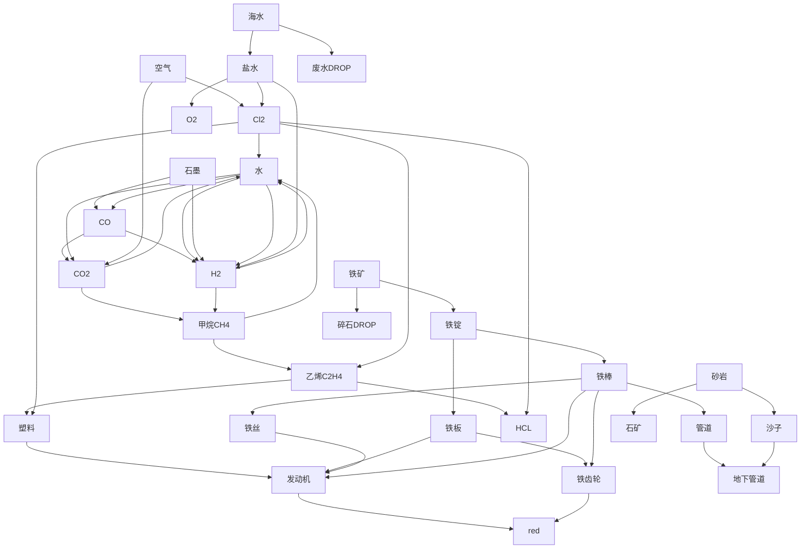

> 2022-04-27T20:42:22+08:00
> 玩factorio发现自顶向下比自底向上效率更高，且更符合人性。为什么呢？因为顶层是简洁的，有秩序感，并且顶层是底层的**发展结果**。当从上往下看，底层的庞大而混乱的结构，抽象成了当前如此简单的黑盒结果，所谓封装。假如底层有铁板/铁齿轮等如此重要的组件，那就需要认真搞稳定。

> 4月最后，开始nullius的red设计，但现在卡在purple的自动化上。玩factorio上瘾是因为很想继续推动整体发展。它就是研究复杂度的媒介。但nullius按照过去玩本体的思路(计算-模块)，有点局限，应该还有其他东西来完善它本身。

About dev and design of factorio.

```mermaid
graph TD;
    AW[铁矿] --> A;
    AX[铜矿] --> F;
    AW --> A;
    N --> A;
    AX --> F;
    N --> F;
    AC --> P;
    N --> P;
    A[铁板] --> C[钢材];
    A --> D[铁齿轮];
    A --> E[管道];
    A --> L[弹匣];
    A --> AA[铁棒];
	F[铜板] --> G[铜线];
    AC[石矿] --> P[石砖];
    G --> H[电路板];
    A --> H;
    F --> I[Red];
    D --> I;
    A --> J[传送带]; %% 一次
    D --> J;
    A --> K[机械臂]; %% 一次
    D --> K;
    H --> K;
    J --> AD[Green];
    K --> AD;
    F --> M[穿中弹匣]; %% 一次
    C --> M;
    L --> M;
    N[煤炭] --> O[手雷]; %% 一次
    A --> O;
    P[石砖] --> Q[墙壁];
    M --> R[Grey];
    O --> R;
    Q --> R;
    S[石油气] --> T[硫磺];
    U[水] --> T[硫磺];
    S --> V[塑料];
    N --> V;
    V --> W[集成电路];
    G --> W;
    H --> W;
    C --> X[内燃机]; %% Yellow
    D --> X;
    E --> X;
    T --> Y[Blue];
    W --> Y;
    X --> Y;
    H --> Z[插件];
    W --> Z;
    F --> AB[中电线杆]; %% 可去掉
    AA --> AB; %% 可去掉
    C --> AB; %% 可去掉
    AC --> AE[铁轨]; %% 一次
    C --> AE;
    AA --> AE;
    P --> AF[电炉]; %% 一次
    C --> AF;
    W --> AF;
    AE --> AG[Purple];
    AF --> AG;
    cZ --> AG;
    AK[重油] --> AL[润滑油];
    F --> AH[轻质框架];
    C --> AH;
    V --> AH;
    H --> AJ[电动机]; %% 一次
    X --> AJ;
    AL --> AJ;
    A --> AL[硫酸];
    T --> AL;
    U --> AL;
    A --> AU[电池];
    F --> AU;
    AL --> AU;
    C --> AI[机器人构架]; %% 一次
    H --> AI;
    AJ --> AI;
    AU --> AI;
    H --> AM[处理器];
    W --> AM;
    AL --> AM;
    AH --> AN[Yellow];
    AI --> AN;
    AM --> AN;
    F --> AP[太阳能板]; %% 以下都是一次
    C --> AP;
    H --> AP;
    A --> AQ[雷达];
    D --> AQ;
    H --> AQ;
    AV[轻油] --> AR[火箭燃剂];
    AS[固体燃料] --> AR;
    A --> AT[蓄电器];
    AU --> AT;
    AM --> AO[White];
    AH --> AO;
    AP --> AO;
    AQ --> AO;
    AR --> AO;
    AT --> AO;
```

#### 结构

1. ##### 可扩展(留空间，多接口). 降低依赖

   1. 给重要度大并且未研发生产的对象留空间
   2. 接口多加个箱子，四个方向。

2. ##### 模块化。

   1. 按照比例分类。(排序按照重要度)
      1. ##TODO 用数据分析可视化一下。
   2. 按照层数分类。层数越低，密集度越高，复杂度越低。
      1. 底层(矿石)
      2. 中层(组装机)
      3. 高层(信息时代 研发中心 核武器)
   3. 输入输出为1.

3. ##### 连接。
   1. 连接灵活。
      1. 位置
      2. 运输 (学习铁路)

#### 细节：

- 科技研发重要度：科技>武器>=生产
- 提高科技发展速度：
  1. 在电路板后加组装机生产插件
  2. 将瓶子生产自上而下模块化扩展
  3. 电路板扩展 再加一组 3个
  4. 平衡瓶子数量产出

#### 分类

1. 科技
2. 生产
3. 武器
   1. 新武器打虫子
   2. 弹药和炮塔自动化
   3. 瓶颈 -> 留余

0119 通关
太空mod有很多新的剧情。再就是铁路信号，通过信号来规划线路，没有用过，蛮好奇。它能怎么用，用来做什么。

0125
nullius 和 重新计算。

#### Nullius

##### plan

> 现在的目标不是精准完美的计算，而是protype。细节考虑点到为止。分几个方面：1. 基建 2. workflow的正常运行

###### 基建

1. 气体类的主要工具是化工厂，固体(铁相关)主要是熔炉/铸造厂。red之后的组装机。破碎机(可手搓，搞沙子用，估计需求不大)
2. 气体回收和废水回收(得搜一下)
3. 管道，需要大量。

###### wf

1. 先到red再看以后的科技树



[ref](https://github.com/W1ndl34F/factorio/blob/main/nullius/nullius0423.md)
